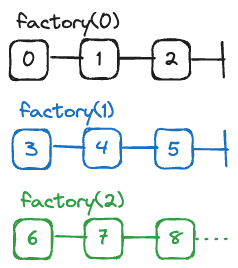
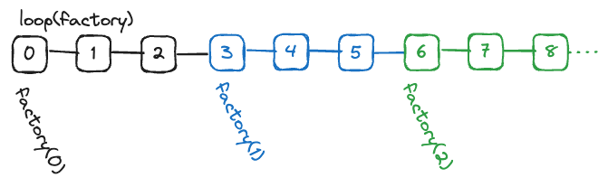
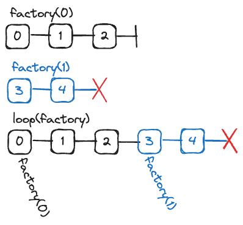

# Rx Xtra: Loop

`loop` creates an RxJS Observable from a callback, calling it with an index so you know how many repetitions have already elapsed.  It combines the lazy instantiation and coercion of [`defer`](https://rxjs.dev/api/index/function/defer) with the repetition control of [`repeat`](https://rxjs.dev/api/index/function/repeat).

`loop` is great when you want to repeat a process and know which repetition you're on.  Paginated results is probably the best use case.

`rx-xtra.loop` is part of [`Rx Xtra`](https://github.com/JoelCodes/rx-xtra), a collection of [RxJS](https://rxjs.dev/) utilities.

Created by Joel Shinness [LinkTree](https://linktr.ee/yesthatjoelshinness) • [Github](https://github.com/JoelCodes) • [Buy me a coffee!](https://ko-fi.com/yesthatjoelshinness)

## Usage

`loop<T>`

* Parameters
  * `factory`: `(index:number) => ObservableInput<T>` Accepts an index that starts at `0` and increments every repetition.  Returns an [`ObservableInput<T>`](https://rxjs.dev/api/index/type-alias/ObservableInput), e.g. an [`Observable<T>`](https://rxjs.dev/api/index/class/Observable), or anything that can be coerced into an `Observable<T>`, such as an Array, Promise, Iterable, or AsyncIterable.
  * `countOrConfig?`: `number`|[`RepeatConfig`](https://rxjs.dev/api/index/interface/RepeatConfig) Limits how many repetitions are possible, and possibly introduces a delay between repetitions.  If no `count` is specified, the output Observable will never `complete`, though it may `error`.
* Returns
  * [`Observable<T>`](https://rxjs.dev/api/index/class/Observable)


Loop provides a functionality similar to `for(let i = 0; true; i++)` in procedural JavaScript, creating an inner Observable from a `factory` function.  The `factory` receives an index that starts from 0, then increments on each repetition.  When the inner Observable is created, its `next` and `error` are fed to the outer Observable, but when it finishes, the loop is done, and a new Observable is generated by the `factory`.

If there is a `RepeatConfig` or `number` given as the second parameter, it can limit the number of repetitions.

> NOTE: This operator has the potential to create a harmful infinite loop, so take the following advice:
> 1. If this is meant to run forever, make sure to include some delays or other asynchrony to keep it from taking over the stack.
> 2. If this is not meant to run forever, put in some limits, e.g. a `count` parameter; using the [`take`](https://rxjs.dev/api/index/function/take), ['takeUntil](https://rxjs.dev/api/index/function/takeUntil) or [`takeWhile`](https://rxjs.dev/api/index/function/takeWhile); or throwing an `error`.

Observe the following diagram.  If there is a `factory` function that produces the following Observables for the inputs `0`, `1`, and `2`, ...



Then calling `loop(factory)` would produce this Observable:



If one of the inner Observables were to error out, then the output Observable would also error out.



## Examples

```ts
import { loop } from 'rx-xtra.loop';
import { takeWhile } from 'rxjs/operators';

type DbRow = { /* Some Data Type */ }

async function getPageOfResults(pageStart:number, pageSize:number):Promise<DbRow[]>{
  const { data } = await SqlQuery(`
  SELECT * 
  FROM dbTable 
  SKIP ? LIMIT ?`, 
  [pageStart, pageSize]);
  return data;
}

function getPages(pageSize:number){
  return loop((index:number) => getPaginatedResults(index * pageSize, pageSize)).pipe(
    takeWhile(results => results.length >= pageSize, true)
  );
}
```

## See Also

* Got an Observable-like thing you want to "coerce" into a real Observable?  Use [`from`](https://rxjs.dev/api/index/function/from)!
* Like being able to convert Observable-like things into real Observables, and like waiting until Subscription to do so, but you don't need the repetition aspect?  Use [`defer`](https://rxjs.dev/api/index/function/defer)!
* Have an existing Observable that you want to subscribe to over and over?  Use [`repeat`](https://rxjs.dev/api/index/function/repeat)!
* Like everything about `loop`, but you don't need the index?  Then you can combine the last two like this: `defer(factory).pipe(repeat(countOrConfig))` 
* Like `loop`, but you have some some state to pass between repetitions?  Then take a look at [`rx-xtra.loop-scan`](https://www.npmjs.com/package/rx-xtra.loop-scan)!
